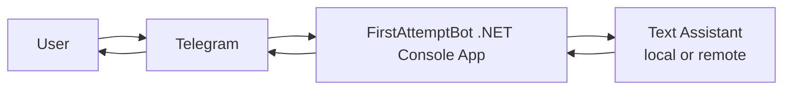

# FirstAttemptBot

A small .NET 8 Telegram bot created for the Microsoft Agents League Hackathon.

The project is intentionally simple so it can be finished quickly, demonstrated clearly, and submitted as a working project.

## What it does

- Receives Telegram messages
- Summarizes text into short bullet points
- Creates a small quiz from the message
- Responds with an easy-to-show demo flow

By default, the bot runs in **local mode**, so it works without any external AI key.

If you want a remote AI backend, set `AI_MODE=remote` and configure an OpenAI-compatible chat endpoint through environment variables.

## Tech stack

- C#
- .NET 8
- Telegram Bot API via raw HTTP
- Optional OpenAI-compatible chat API

## Project structure

```text
AIStudentHelper/
├── AIStudentHelper.sln
├── FirstAttemptBot/
│   ├── FirstAttemptBot.csproj
│   ├── Program.cs
│   ├── TelegramBotClient.cs
│   ├── TextAssistant.cs
│   ├── LocalTextAssistant.cs
│   ├── RemoteTextAssistant.cs
│   ├── Models.cs
│   └── Properties/
│       └── launchSettings.json
├── docs/
│   └── architecture.md
└── .env.example
```

## Architecture



## Commands

- `/start` — welcome message
- `/help` — usage help
- `/summary <text>` — summarize text
- `/quiz <text>` — create a short quiz
- `/about` — project info

If the user sends plain text, the bot will summarize it automatically.

## How to run

1. Create a Telegram bot with BotFather and copy the token.
2. Set environment variables:
   - `TELEGRAM_BOT_TOKEN`
   - optional `AI_MODE`
   - optional `AI_API_URL`
   - optional `AI_API_KEY`
   - optional `AI_MODEL`
3. Open `FirstAttemptBot.sln` in Visual Studio Community 2022.
4. Run the project.

## Hackathon submission tips

For a fast submission, include:

- public GitHub repository
- short demo video
- simple architecture diagram
- working bot demo with at least one clear user flow

## Notes

This repository is ready to customize for your final submission. You can rename the bot, adjust the commands, or connect a different AI provider later.
