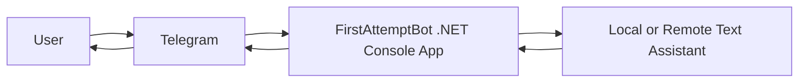

# Architecture

## Data flow

1. A user sends a message in Telegram.
2. Telegram forwards the update to the bot.
3. The bot decides whether the message is a command or plain text.
4. The assistant builds the response.
5. The bot sends the answer back to Telegram.
